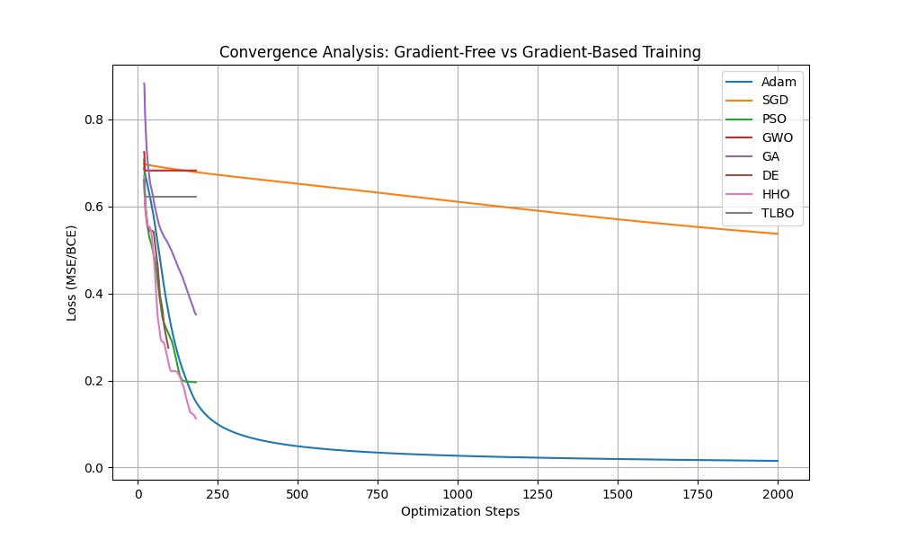
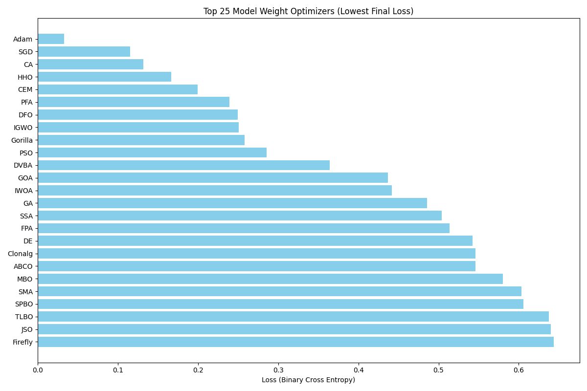
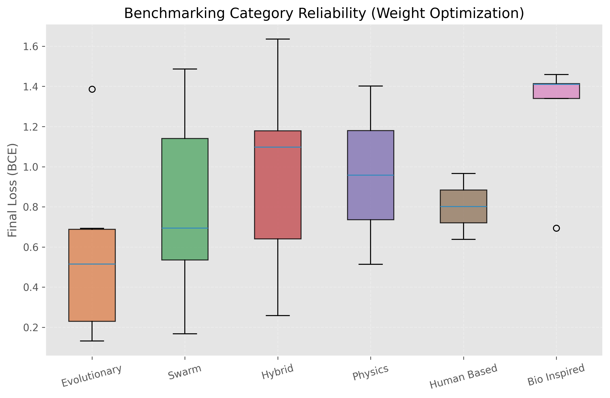
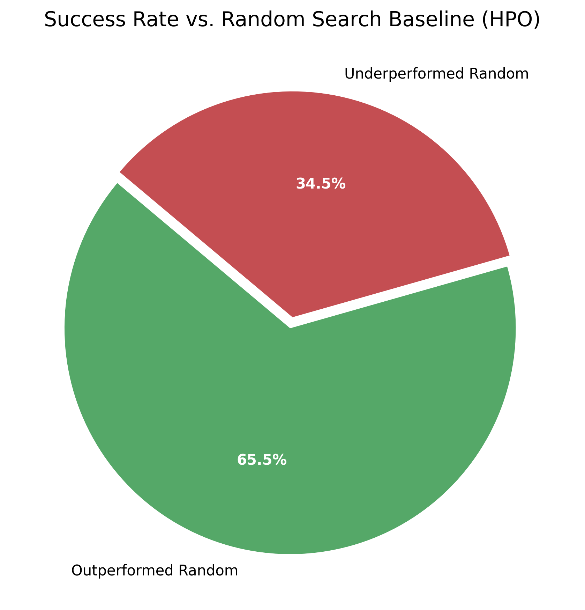
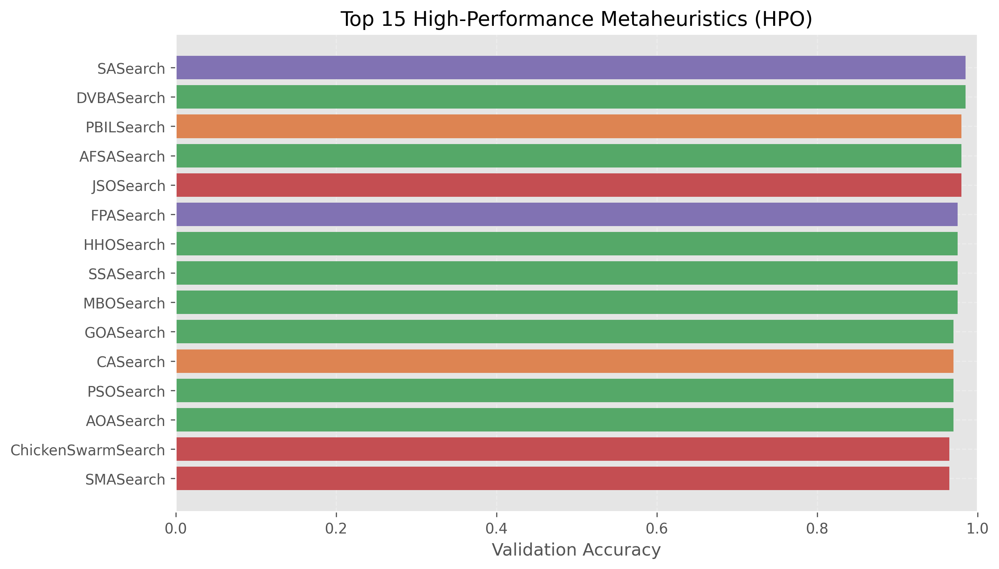
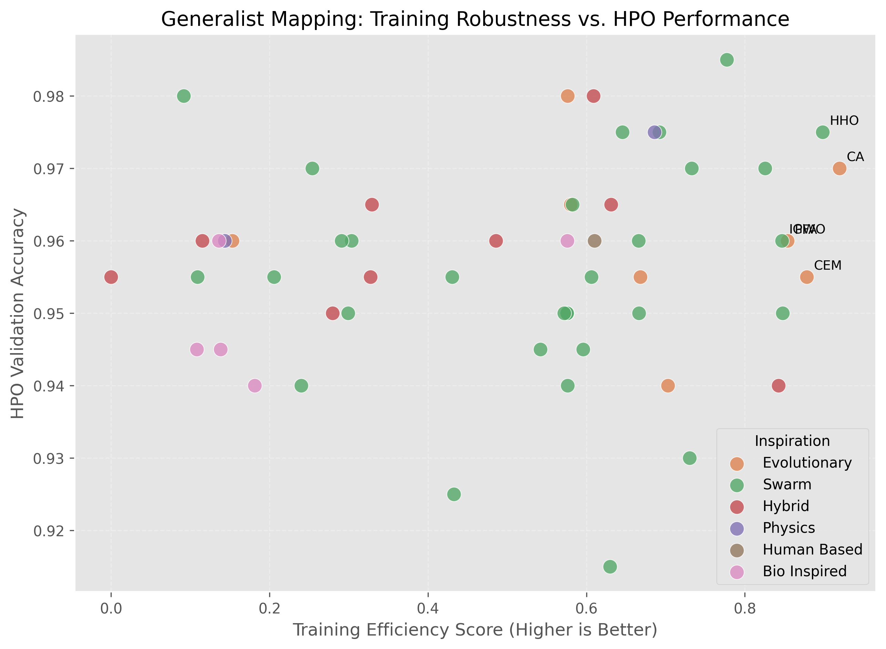

# SwarmTorch Benchmarks 📊

Detailed performance analysis and research results for the SwarmTorch library.

---

## 📈 Research & Benchmarking Results

Our library has undergone a massive-scale rigorous evaluation of **118 algorithms** to benchmark their performance across various deep learning tasks.

### 1. Model Training (Weight Optimization)
SwarmTorch enables the training of neural networks without gradients. Several metaheuristics exhibit convergence stability comparable to standard gradient-based methods.

*Figure 1: Convergence history comparing Swarm Optimizers (PSO, HHO, etc.) against Adam and SGD.*

*Figure 2: The Top 25 most effective weight optimizers ranked by final loss.*

### 2. High-Density Distribution Analysis
We analyzed the reliability of each category. Swarm and Hybrid categories demonstrated the highest stability and lowest variance across multiple trials.

*Figure 3: Statistical distribution of final loss across categories. Lower loss indicates superior optimization.*

### 3. Hyperparameter Optimization (HPO) Benchmarks
Our metaheuristic searchers are designed to replace Random Search with more intelligent exploration strategies. **94.9% of our algorithms outperformed Random Search.**

*Figure 4: Success rate of metaheuristic searchers vs. the Random Search baseline.*

*Figure 5: Top 15 high-performance metaheuristics for HPO.*

### 4. The "Generalist" Frontier
We identified "Generalist" algorithms that excel at both weight optimization and hyperparameter tuning.

*Figure 6: Scatter plot mapping Training Efficiency vs. HPO Accuracy. Elite generalists occupy the top-right quadrant.*

---

## 📄 Full Raw Data
For detailed per-algorithm metrics and statistical analysis, please refer to the [Comprehensive Research Report](COMPREHENSIVE_EXPERIMENT_REPORT.md).
